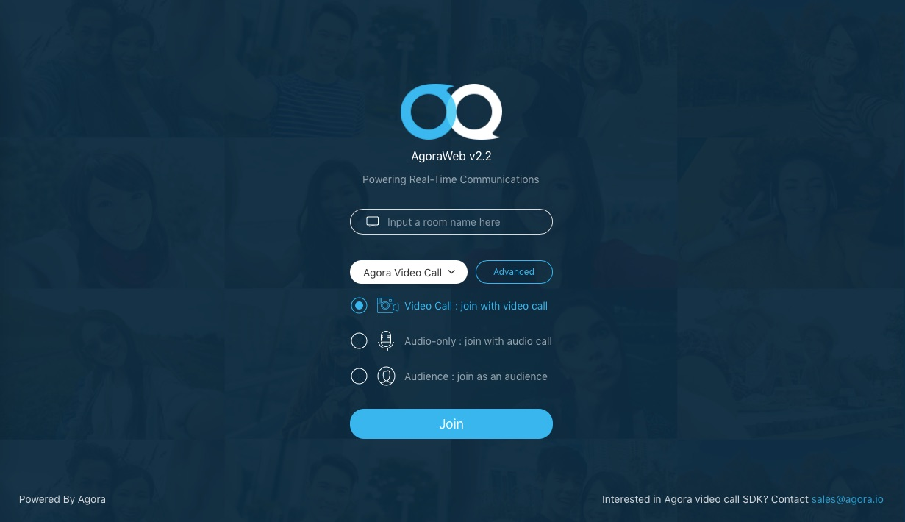

# Agora Open Video Call for Web

*Read this in other languages: [中文](README.zh.md)*

This tutorial shows you how to quickly create an open video call using the Agora sample app and the [Agora 2.0+ API](https://docs.agora.io/en/2.2/product/Voice/API%20Reference/communication_web_audio#voice-call-api).

## Prerequisites
- Agora.io Developer Account
- Node.js 6.9.1+
- A web server that supports SSL (https)

## Quick Start
This section shows you how to prepare, build, and run the sample application.

### Create an Account and Obtain an App ID
To build and run the sample application, get an App ID: 

1. Create a developer account at [agora.io](https://dashboard.agora.io/signin/).
2. In the Dashboard that opens, click **Projects** > **Project List** in the left navigation.
3. Copy the **App ID** from the Dashboard to a text file. You will use this when you launch the app.
4. Open the **src/utils/Settings.js** file. At the bottom of the file, replace `<#YOUR APP ID#>` with the App ID from the dashboard.

	**Note:** Place the App ID within single or double quotes.

```xml
export const APP_ID = <#YOUR APP ID#>;
```
	
### Update and Run the Sample Application 

1. Using the Terminal app, enter the `install` command in your project directory. This command installs libraries that are required to run the sample application.

	``` bash
	# install dependencies
	npm install
	```

2. Start the application by entering the `run dev` or `run build` command.

	The `run dev` command is for development purposes.

	``` bash
	# serve with hot reload at localhost:8080
	npm run dev
	```

	The `run build` command is for production purposes and minifies code.

	``` bash
	# build for production with minification
	npm run build
	```
	
3. Your default browser should open and display the sample application, as shown here.

	

	**Note:** In some cases, you may need to open a browser and enter `http://localhost:8080` as the URL.

4. Additional commands are available for the sample application.

	Use the `run lint` command to use [**ESLint**](https://eslint.org/) and `run format` command to improve code quality.

	``` bash
	# use eslint and prettier to improve code quality
	npm run lint
	npm run format
	```

	Use the `run test` command to run unit tests.

	``` bash
	# unit testing
	npm run test
	```

## Resources
* A detailed code walkthrough for this sample is available in [Steps to Create this Sample](./guide.md).
* Complete API documentation is available at the [Document Center](https://docs.agora.io/en/).
* You can file bugs about this sample [here](https://github.com/AgoraIO/Basic-Video-Call/issues).

## License
This software is under the MIT License (MIT). [View the license](LICENSE.md).
