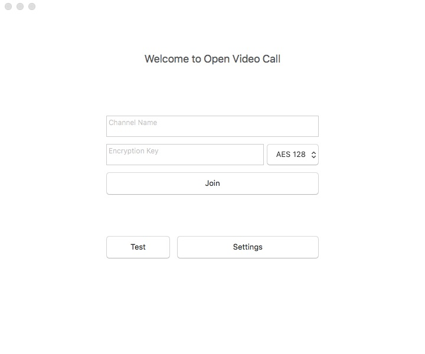

# Open Video Call for MacOS (Swift)

*Read this in other languages: [中文](README.zh.md)*

This tutorial describes how to add video chat to your MacOS applications using Swift and the Agora Video SDK.

With this sample app, you can:

- [Join a channel](#create-the-loadagorakit-method)
- [Leave a channel](#create-the-leavechannel-method)
- [Mute/unmute video and audio](#muteunmute-video-and-audio-methods)
- [Enable/disable video](#enabledisable-video)
- [Create input/output devices](#create-inputoutput-device-change-methods)
- [Send a message to a channel](#create-the-send-method)
- [Screen share](#screen-share-and-filter-methods)
- [Set the resolution, the height, and the frame rate](#create-the-remotevideostats-event-listener)
- [Enable encryption](#create-the-loadagorakit-method)

## Prerequisites
- Xcode 10.0+

## Quick Start

This section shows you how to prepare, build, and run the sample application.

- [Create an Account and Obtain an App ID](#create-an-account-and-obtain-an-app-id)
- [Update and Run the Sample Application](#update-and-run-the-sample-application) 


### Create an Account and Obtain an App ID
To build and run the sample application, you must obtain an app ID: 

1. Create a developer account at [agora.io](https://dashboard.agora.io/signin/). Once you finish the sign-up process, you are redirected to the dashboard.
2. Navigate in the dashboard tree on the left to **Projects** > **Project List**.
3. Copy the app ID that you obtained from the dashboard into a text file. You will use this when you launch the application.


### Update and Run the Sample Application 

1. Open `OpenVideoCall.xcodeproj` and edit the [`KeyCenter.swift`](OpenVideoCall/KeyCenter.swift) file. In the `KeyCenter` declaration, update `<#Your App Id#>` with your app ID.

	``` Swift
    static let AppId: String = <#Your App Id#>
	```

2. Download the [Agora Video SDK](https://www.agora.io/en/download/). Unzip the downloaded SDK package and copy the `AgoraRtcEngineKit.framework` file from the SDK `libs` folder into the sample application `OpenVideoCall` folder.

	
		
3. Build and run the project. Ensure a valid provisioning profile is applied or your project will not run. Your application will look like this when it loads.



## Resources
- A detailed code walkthrough for this sample is available in [Steps to Create this Sample](./guide.md).
- Find full [API documentation in the Developer Center](https://docs.agora.io/en/). 
- [File bugs about this sample](https://github.com/AgoraIO/Basic-Video-Call/issues).


## License
This software is licensed under the MIT License (MIT). [View the license](LICENSE.md).